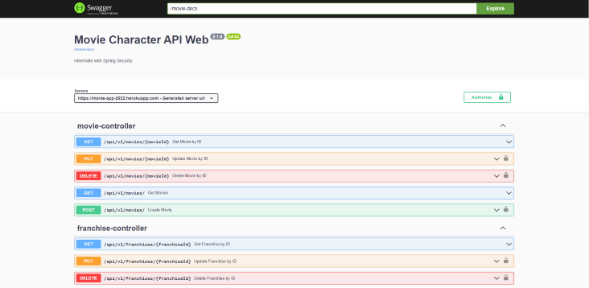
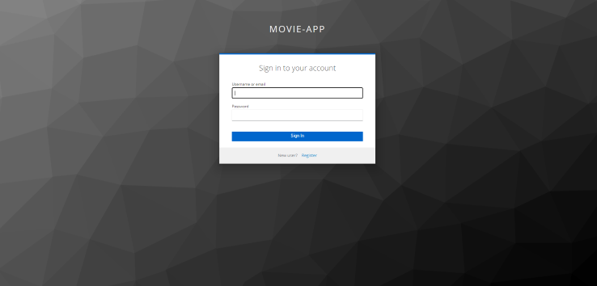

# movie-characters-api

[](https://github.com/RichardLitt/standard-readme)
[](https://movie-app-2022.herokuapp.com/swagger-ui/index.html)

Noroff Java Fullstack bootcamp Assignment 7: Create a Web API and database with Spring

- [PostgreSQL](https://www.postgresql.org/) database using [Hibernate](https://hibernate.org/)
- [Spring](https://spring.io/) Web API to access endpoints, which are exposed and documentation provided by [Swagger](https://swagger.io/) OpenAPI
- Access Management with [Keycloak](https://www.keycloak.org/)
- [Docker](https://www.docker.com/) image deployed on [Heroku](https://www.heroku.com/)





## Table of Contents

- [Security](#security)
- [Install](#install)
- [Usage](#usage)
- [API](#api)
- [Maintainers](#maintainers)
- [Contributing](#contributing)
- [License](#license)

## Security

Security layer added to app.

- Keycloak access management is handling logging and registering of users

## Install

Clone
```
https://github.com/teemunasanen/movie-characters-api.git
```

## Usage

Run locally with IDE of your choice (IntelliJ is great!)

## API

Database for:
- Movies
- Characters
- Franchises

Swagger OpenAPI providing more info.

Local URLS:
- http://localhost:8080/swagger-ui/index.html
- http://localhost:8080/movie-docs

[Heroku Deployment](https://movie-app-2022.herokuapp.com/swagger-ui/index.html)

## Maintainers

[@bgf122](https://github.com/bgf122)
[@teemunasanen](https://github.com/teemunasanen)

## Contributing

PRs accepted.

Small note: If editing the README, please conform to the [standard-readme](https://github.com/RichardLitt/standard-readme) specification.

## License

MIT © 2022 Sasu Korhonen & Teemu Näsänen